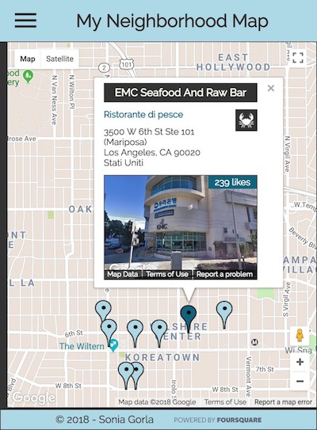

# My Neighborhood React App

## Project Description

This app is a project made with React for the completion of the [Udacity's Front-End Web Developer Nanodegree](https://www.udacity.com/course/front-end-web-developer-nanodegree--nd001?v=fe1).

## Instructions

Build a single page map application using React and the Google Maps API. Integrate a third-party data API and make the app accessible, responsive and usable.

## How to start

1. Clone or download the repository;

2. Inside of the root folder, create a .env file where to store the API keys for Google Maps and Foursquare. The file has the following structure (notations between quotes must be replaced with the actual API keys):

            REACT_APP_GM_API_KEY="Google Maps API key"
            REACT_APP_FSQ_CLIENTID="Foursquare Client ID"
            REACT_APP_FSQ_CLIENTSECRET="Foursquare Client Secret"

3. In the terminal, cd into the root folder, and input the command `$ npm install` to install the dependencies.

4. Type `$ npm start`. The app will open in the browser automatically.

## Project overview

This app consists in a neighborhood map that uses the Google Maps APIs. The map displays 10 venues listed inside of a side menu in alphabetical order. The corresponding markers are placed in the map upon loading the app. 

The venues can be selected from the map, by clicking on the markers, or from the listbox. It is possible to search for venues by typing a query on the searchbar in the side menu. This will filter the places by their name, and the filtering will be displayed in both the list and the map. The "x" button on the search bar will clear the input, deselect any active place/marker, and show again all the places/markers.

Once a venue is selected by either clicking on a list item in the listbox, or on a marker in the map, the selection is displayed in the list, the marker animates, and an infowindow opens above it displaying some information about the venue fetched with the Foursquare API (name, address, category, and icon), and the streetview of it.

The app is fully responsive and accessible. All the features can be used with either the mouse or the keyboard.

### Desktop

### Mobile
 

## Dependencies:

- [React](https://reactjs.org/)
- [google-maps-react](https://github.com/fullstackreact/google-maps-react)
- [escape-string-regexp](https://www.npmjs.com/package/escape-string-regexp)
- [sort-by](https://www.npmjs.com/package/sort-by)
- [Foursquare](https://developer.foursquare.com/)
- Icons: [https://www.materialui.co/](https://www.materialui.co/)
- Map style: [Snazzy Maps](https://snazzymaps.com/style/44/map)
